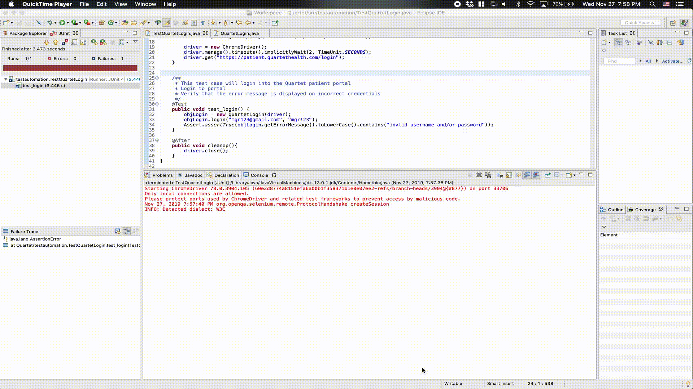

# Quartet

## Table of Contents
[Introduction](#introduction)  
[How-to-run](#how-to-run)  
[Enhancements](#enhancements)  

## Introduction
This is an eclipse project using Selenium to test the login portal of Quartet.

## How-to-run
The test can be run with JUnit inside of eclipse.

## Enhancements
The following enhancements can be done in the future and should be revisited when
used in a production environment:
* Timeouts globally defined
* Using _@CacheLookup_ to make the lookup once and cache elements
* Check for other browsers
* Additional Testcases could be:
  * Check for correct credentials
  * Check for incorrect format of username/email
